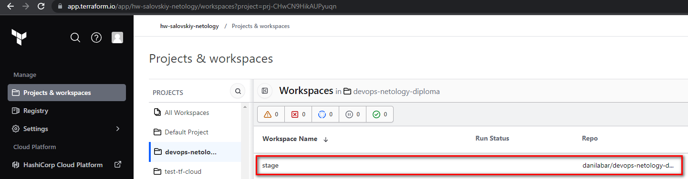

# Дипломный практикум в Yandex.Cloud

<details><summary>Раскрыть для просмотра задания</summary>

  * [Цели:](#цели)
  * [Этапы выполнения:](#этапы-выполнения)
     * [Создание облачной инфраструктуры](#создание-облачной-инфраструктуры)
     * [Создание Kubernetes кластера](#создание-kubernetes-кластера)
     * [Создание тестового приложения](#создание-тестового-приложения)
     * [Подготовка cистемы мониторинга и деплой приложения](#подготовка-cистемы-мониторинга-и-деплой-приложения)
     * [Установка и настройка CI/CD](#установка-и-настройка-cicd)
  * [Что необходимо для сдачи задания?](#что-необходимо-для-сдачи-задания)
  * [Как правильно задавать вопросы дипломному руководителю?](#как-правильно-задавать-вопросы-дипломному-руководителю)

---
## Цели:

1. Подготовить облачную инфраструктуру на базе облачного провайдера Яндекс.Облако.
2. Запустить и сконфигурировать Kubernetes кластер.
3. Установить и настроить систему мониторинга.
4. Настроить и автоматизировать сборку тестового приложения с использованием Docker-контейнеров.
5. Настроить CI для автоматической сборки и тестирования.
6. Настроить CD для автоматического развёртывания приложения.

---
## Этапы выполнения:


### Создание облачной инфраструктуры

Для начала необходимо подготовить облачную инфраструктуру в ЯО при помощи [Terraform](https://www.terraform.io/).

Особенности выполнения:

- Бюджет купона ограничен, что следует иметь в виду при проектировании инфраструктуры и использовании ресурсов;
- Следует использовать последнюю стабильную версию [Terraform](https://www.terraform.io/).

Предварительная подготовка к установке и запуску Kubernetes кластера.

1. Создайте сервисный аккаунт, который будет в дальнейшем использоваться Terraform для работы с инфраструктурой с необходимыми и достаточными правами. Не стоит использовать права суперпользователя
2. Подготовьте [backend](https://www.terraform.io/docs/language/settings/backends/index.html) для Terraform:  
   а. Рекомендуемый вариант: [Terraform Cloud](https://app.terraform.io/)  
   б. Альтернативный вариант: S3 bucket в созданном ЯО аккаунте
3. Настройте [workspaces](https://www.terraform.io/docs/language/state/workspaces.html)  
   а. Рекомендуемый вариант: создайте два workspace: *stage* и *prod*. В случае выбора этого варианта все последующие шаги должны учитывать факт существования нескольких workspace.  
   б. Альтернативный вариант: используйте один workspace, назвав его *stage*. Пожалуйста, не используйте workspace, создаваемый Terraform-ом по-умолчанию (*default*).
4. Создайте VPC с подсетями в разных зонах доступности.
5. Убедитесь, что теперь вы можете выполнить команды `terraform destroy` и `terraform apply` без дополнительных ручных действий.
6. В случае использования [Terraform Cloud](https://app.terraform.io/) в качестве [backend](https://www.terraform.io/docs/language/settings/backends/index.html) убедитесь, что применение изменений успешно проходит, используя web-интерфейс Terraform cloud.

Ожидаемые результаты:

1. Terraform сконфигурирован и создание инфраструктуры посредством Terraform возможно без дополнительных ручных действий.
2. Полученная конфигурация инфраструктуры является предварительной, поэтому в ходе дальнейшего выполнения задания возможны изменения.

---
### Создание Kubernetes кластера

На этом этапе необходимо создать [Kubernetes](https://kubernetes.io/ru/docs/concepts/overview/what-is-kubernetes/) кластер на базе предварительно созданной инфраструктуры.   Требуется обеспечить доступ к ресурсам из Интернета.

Это можно сделать двумя способами:

1. Рекомендуемый вариант: самостоятельная установка Kubernetes кластера.  
   а. При помощи Terraform подготовить как минимум 3 виртуальных машины Compute Cloud для создания Kubernetes-кластера. Тип виртуальной машины следует выбрать самостоятельно с учётом требовании к производительности и стоимости. Если в дальнейшем поймете, что необходимо сменить тип инстанса, используйте Terraform для внесения изменений.  
   б. Подготовить [ansible](https://www.ansible.com/) конфигурации, можно воспользоваться, например [Kubespray](https://kubernetes.io/docs/setup/production-environment/tools/kubespray/)  
   в. Задеплоить Kubernetes на подготовленные ранее инстансы, в случае нехватки каких-либо ресурсов вы всегда можете создать их при помощи Terraform.
2. Альтернативный вариант: воспользуйтесь сервисом [Yandex Managed Service for Kubernetes](https://cloud.yandex.ru/services/managed-kubernetes)  
  а. С помощью terraform resource для [kubernetes](https://registry.terraform.io/providers/yandex-cloud/yandex/latest/docs/resources/kubernetes_cluster) создать региональный мастер kubernetes с размещением нод в разных 3 подсетях      
  б. С помощью terraform resource для [kubernetes node group](https://registry.terraform.io/providers/yandex-cloud/yandex/latest/docs/resources/kubernetes_node_group)
  
Ожидаемый результат:

1. Работоспособный Kubernetes кластер.
2. В файле `~/.kube/config` находятся данные для доступа к кластеру.
3. Команда `kubectl get pods --all-namespaces` отрабатывает без ошибок.

---
### Создание тестового приложения

Для перехода к следующему этапу необходимо подготовить тестовое приложение, эмулирующее основное приложение разрабатываемое вашей компанией.

Способ подготовки:

1. Рекомендуемый вариант:  
   а. Создайте отдельный git репозиторий с простым nginx конфигом, который будет отдавать статические данные.  
   б. Подготовьте Dockerfile для создания образа приложения.  
2. Альтернативный вариант:  
   а. Используйте любой другой код, главное, чтобы был самостоятельно создан Dockerfile.

Ожидаемый результат:

1. Git репозиторий с тестовым приложением и Dockerfile.
2. Регистр с собранным docker image. В качестве регистра может быть DockerHub или [Yandex Container Registry](https://cloud.yandex.ru/services/container-registry), созданный также с помощью terraform.

---
### Подготовка cистемы мониторинга и деплой приложения

Уже должны быть готовы конфигурации для автоматического создания облачной инфраструктуры и поднятия Kubernetes кластера.  
Теперь необходимо подготовить конфигурационные файлы для настройки нашего Kubernetes кластера.

Цель:
1. Задеплоить в кластер [prometheus](https://prometheus.io/), [grafana](https://grafana.com/), [alertmanager](https://github.com/prometheus/alertmanager), [экспортер](https://github.com/prometheus/node_exporter) основных метрик Kubernetes.
2. Задеплоить тестовое приложение, например, [nginx](https://www.nginx.com/) сервер отдающий статическую страницу.

Рекомендуемый способ выполнения:
1. Воспользовать пакетом [kube-prometheus](https://github.com/prometheus-operator/kube-prometheus), который уже включает в себя [Kubernetes оператор](https://operatorhub.io/) для [grafana](https://grafana.com/), [prometheus](https://prometheus.io/), [alertmanager](https://github.com/prometheus/alertmanager) и [node_exporter](https://github.com/prometheus/node_exporter). При желании можете собрать все эти приложения отдельно.
2. Для организации конфигурации использовать [qbec](https://qbec.io/), основанный на [jsonnet](https://jsonnet.org/). Обратите внимание на имеющиеся функции для интеграции helm конфигов и [helm charts](https://helm.sh/)
3. Если на первом этапе вы не воспользовались [Terraform Cloud](https://app.terraform.io/), то задеплойте в кластер [atlantis](https://www.runatlantis.io/) для отслеживания изменений инфраструктуры.

Альтернативный вариант:
1. Для организации конфигурации можно использовать [helm charts](https://helm.sh/)

Ожидаемый результат:
1. Git репозиторий с конфигурационными файлами для настройки Kubernetes.
2. Http доступ к web интерфейсу grafana.
3. Дашборды в grafana отображающие состояние Kubernetes кластера.
4. Http доступ к тестовому приложению.

---
### Установка и настройка CI/CD

Осталось настроить ci/cd систему для автоматической сборки docker image и деплоя приложения при изменении кода.

Цель:

1. Автоматическая сборка docker образа при коммите в репозиторий с тестовым приложением.
2. Автоматический деплой нового docker образа.

Можно использовать [teamcity](https://www.jetbrains.com/ru-ru/teamcity/), [jenkins](https://www.jenkins.io/) либо [gitlab ci](https://about.gitlab.com/stages-devops-lifecycle/continuous-integration/)

Ожидаемый результат:

1. Интерфейс ci/cd сервиса доступен по http.
2. При любом коммите в репозиторие с тестовым приложением происходит сборка и отправка в регистр Docker образа.
3. При создании тега (например, v1.0.0) происходит сборка и отправка с соответствующим label в регистр, а также деплой соответствующего Docker образа в кластер Kubernetes.

---
## Что необходимо для сдачи задания?

1. Репозиторий с конфигурационными файлами Terraform и готовность продемонстрировать создание всех ресурсов с нуля.
2. Пример pull request с комментариями созданными atlantis'ом или снимки экрана из Terraform Cloud.
3. Репозиторий с конфигурацией ansible, если был выбран способ создания Kubernetes кластера при помощи ansible.
4. Репозиторий с Dockerfile тестового приложения и ссылка на собранный docker image.
5. Репозиторий с конфигурацией Kubernetes кластера.
6. Ссылка на тестовое приложение и веб интерфейс Grafana с данными доступа.
7. Все репозитории рекомендуется хранить на одном ресурсе (github, gitlab)

---
## Как правильно задавать вопросы дипломному руководителю?

Что поможет решить большинство частых проблем:

1. Попробовать найти ответ сначала самостоятельно в интернете или в 
  материалах курса и ДЗ и только после этого спрашивать у дипломного 
  руководителя. Скилл поиска ответов пригодится вам в профессиональной 
  деятельности.
2. Если вопросов больше одного, то присылайте их в виде нумерованного 
  списка. Так дипломному руководителю будет проще отвечать на каждый из 
  них.
3. При необходимости прикрепите к вопросу скриншоты и стрелочкой 
  покажите, где не получается.

Что может стать источником проблем:

1. Вопросы вида «Ничего не работает. Не запускается. Всё сломалось». 
  Дипломный руководитель не сможет ответить на такой вопрос без 
  дополнительных уточнений. Цените своё время и время других.
2. Откладывание выполнения курсового проекта на последний момент.
3. Ожидание моментального ответа на свой вопрос. Дипломные руководители работающие разработчики, которые занимаются, кроме преподавания, 
  своими проектами. Их время ограничено, поэтому постарайтесь задавать правильные вопросы, чтобы получать быстрые ответы :)

</details>

## Создание облачной инфраструктуры

Создал сервисный [аккаунт](https://cloud.yandex.ru/docs/cli/operations/authentication/service-account)  
Создал авторизованный ключ  
```bash
yc iam key create --service-account-id ajeqt1uae90pgp2ftkns --output key.json
```  

  

  

В качестве бекенда выбрал Terraform Cloud  
Предварительно в настройках GitHub разрешил доступ для Terraform Cloud  

  

Создал проект и workspace `stage` в TC  

  

В настройках workspace указал рабочий каталог для Terraform  

Добавил в workspace переменные:  
- `service_account_id` данные сервисного аккаунта для деплоя ресурсов в yandex cloud
- `DOCKER_USER_ID` - пользователь Docker Registry (используется при деплое ci/cd)
- `DOCKER_PASSWORD` - API ключ для доступа к Docker Registry (предварительно получив его в настройках аккаунта Docker Hub)(используется при деплое ci/cd)
- `JENKINS_ADMIN_PASSWORD` - пароль для доступа к UI JENKINS (используется при деплое ci/cd)  

  

Все манифесты Terraform находятся в каталоге [terraform](terraform)  

Создание ресурсов YC в основном описано в:
- [main.tf](terraform/main.tf)
- [network.tf](terraform/network.tf)
- [meta.tf](terraform/meta.tf)
- [lb.tf](terraform/lb.tf)

Ручной `terraform plan` проходит успешно  

  

Автоматический`terraform plan` по коммиту в репозиторий так же успешно инициализирован  

  

При выполнении `terraform apply` ресурсы успешно создаются в YC  

  

```text
Далее весь проект разворачивается при помощи terraform.
После применения terraform apply по истечении двух часов имеем готовый k8s кластер с мониторингом и ci/cd
```  

  
  
  

## Создание Kubernetes кластера

Выбрал вариант самостоятельной установки Kubernetes кластера при помощи [Kubespray](https://kubernetes.io/docs/setup/production-environment/tools/kubespray/)  

Моя Ansible конфигурация кластера описана в каталоге [ansible](ansible)  

Так же часть конфигурации в т.ч inventory формируется в рантайме с помощью terraform:
- [ansible.tf](terraform/ansible.tf) - предварительное конфигурирование агента terraform и запуск ansible
- [inventory.tf](terraform/inventory.tf) - формирование inventory
- [kubeconfig.tf](terraform/kubeconfig.tf) - доставка `/.kube/config` агенту terraform и проверка работы кластера
  
Сформированный inventory  

  

Проверка доступности кластера `kubectl get pods --all-namespaces`  

  

Дополнительно скопировал `/.kube/config` себе на локальную машину и проверил доступность кластера

```bash
scp -o 'StrictHostKeyChecking no' centos@51.250.9.89:/home/centos/.kube/config $HOME/.kube/config
sed -i 's/127.0.0.1/51.250.9.89/g' $HOME/.kube/config
kubectl get pods --all-namespaces
```  

  

### Особенности

В ходе работы выяснил несколько особенностей связанных с запуском ansible на агенте terraform cloud:
- Для доступа агента TC на хосты нужно сгенерировать ssh-ключ (по сути одноразовый, т.к. он уничтожается вместе с 
агентом после завершения деплоя) и добавить его на разворачиваемые виртуалки вместе со своим. Но это в случае если не 
хочется добавлять свой приватный ключ в terraform cloud
- Из-за того, что имя домашнего каталога учётки агента TC слишком длинное, запуск ansible завершается ошибкой. 
Это решено с помощью директивы `control_path` в [ansible.cfg](terraform/ansible.cfg)

## Создание тестового приложения

Для тестового приложения создан отдельный Git репозиторий [wonder_app](https://github.com/danilabar/wonder_app)  

Сборка образа приложения описана в [Dockerfile](https://github.com/danilabar/wonder_app/blob/main/Dockerfile)  

Образ опубликован в [DockerHub](https://hub.docker.com/r/danilabar/wonder_app)

## Подготовка cистемы мониторинга и деплой приложения

Для деплоя системы мониторинга воспользовался пакетом [kube-prometheus](https://github.com/prometheus-operator/kube-prometheus)  

Конфигурации описаны в:
- [monitoring.tf](terraform/monitoring.tf) - деплой `kube-prometheus` в кластер
- Каталог [kube-prometheus](kube-prometheus) - манифесты kubernetes для деплоя, взяты как есть, кроме двух файлов
  - [grafana-service.yaml](kube-prometheus/manifests/grafana-service.yaml) - настройка `nodePort`
  - [grafana-networkPolicy.yaml](kube-prometheus/manifests/grafana-networkPolicy.yaml) - настройка `ingress`  

Grafana доступна [http://158.160.46.231:3000/](http://158.160.46.231:3000/) и дашборды отображают состояние Kubernetes кластера  

  

  

Для организации конфигурации тестового приложения создан [helm-chart](https://github.com/danilabar/wonder_app/tree/main/wonder-app-chart)  

Тесовое приложение задеплоено в кластер и доступно по http

  

  

  

## Установка и настройка CI/CD

В качестве CI/CD выбрал [jenkins](https://www.jenkins.io/)  

Конфигурации описаны в каталоге [jenkins](jenkins)  
- Отдельно был собран собственный Docker образ jenkins [Dockerfile](jenkins/image/Dockerfile). В нем описаны:
  - Установка kubectl, helm, docker
  - Установка плагинов jenkins
  - Отключение первоначальной конфигурации
  - Использование плагина Configuration as Code
    - Конфигурация jenkins описана в [casc.yaml](jenkins/image/casc.yaml)
    - Конфигурация pipeline описана в [config.xml](jenkins/image/jobs/app-stage/config.xml)
- Образ опубликован в [DockerHub](https://hub.docker.com/r/danilabar/jenkins-with-addons)  
- [jenkins.tf](terraform/jenkins.tf) - деплой jenkins в кластер
- Каталог [kube-deploy](jenkins/kube-deploy) - Манифесты kubernetes
- В репозитории с тестовым приложением находится [Jenkinsfile](https://github.com/danilabar/wonder_app/blob/main/Jenkinsfile/Jenkinsfile) описывающий пайплайн

Интерфейс jenkins доступен по [http://158.160.46.231:8080/](http://158.160.46.231:8080/)  

  

### При любом коммите в репозиторие с тестовым приложением происходит сборка и отправка в регистр Docker образа

#### Выполнен [коммит](https://github.com/danilabar/wonder_app/commit/adb4333e381fb88839f38812b2a5e2f9827e208e)  

- Пайплайн  

  

- DockerHub  

  

#### Выполнен второй [коммит](https://github.com/danilabar/wonder_app/commit/290bbcc43feb8369eb069a3ca2193b2591cc71ac)

- Пайплайн  

  

- DockerHub  

  

### При создании тега происходит сборка и отправка с соответствующим label в регистр, а также деплой соответствующего Docker образа в кластер Kubernetes

#### Выполнен [коммит](https://github.com/danilabar/wonder_app/commit/7c325537775895d5f0b16430115eb592b7989fc4) с тегом 1.1.0  

- Пайплайн  

  

  

- DockerHub  

  

- Приложение доступно по [http://158.160.46.231/](http://158.160.46.231/)  


#### Выполнен второй [коммит](https://github.com/danilabar/wonder_app/commit/396495b7286bdb97f25f5564435eed25902537ef) с тегом 1.2.4

- Пайплайн  

  

  

- DockerHub  

  

- Приложение доступно по [http://158.160.46.231/](http://158.160.46.231/)  

  

### Особенности

- Первую сборку по ветке `main` нужно запустить вручную, тогда jenkins получит расписание для пайплайна по коммиту, 
но самой сборки образа не произойдёт, т.к. пайплайн общий на два сценария и в нём используются триггеры по тегам и 
условия для коммитов, а первая сборка ручная. Сборка по тегам при этом запускается автоматически, при обнаружении тегов.
- При деплое jenkins дополнительно используется утилита `envsubst`, для того, что бы в [deployment.yaml](jenkins/kube-deploy/deployment.yaml) 
некоторые параметры были использованы из переменных окружения.